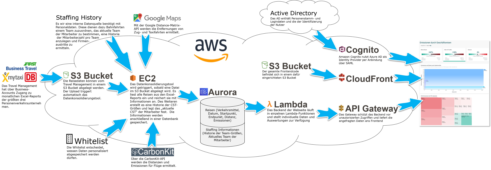

# Vagabundo (CO2 tracking web application for business trips)

## What it does
Vagabundo is a business trip CO2-tracking tool for small companies. It allows employees to view their own CO2 footprint as well as their team's and the company's.

## How it works
To tool mainly consists of three parts
1) The **consolidation backend**: A batch job that is triggered at certain times/certain events and wirtes data into the data base. This part is not included in the public code since it uses internal APIs in order to consolidate the data.
2) The **calculation backend**: Different services that are triggerd on demand via the API, do calculations based on the data in the data base and return re required values.
3) The **frontend**: Here the user view the statistics and can select a certain period of time.

## Participants in alphabetical order
[Hans Homburg](https://github.com/GitHansHub), [Dirk Kirsten](https://github.com/dirkk), [Manuel Kniep](https://github.com/maaaNu) , [Yankang Li](https://github.com/iseelotus), [Olof Nord](https://github.com/olof-nord), [Florian Rudisch](https://github.com/frudisch), [David Scheer](https://github.com/DavidScheer)
